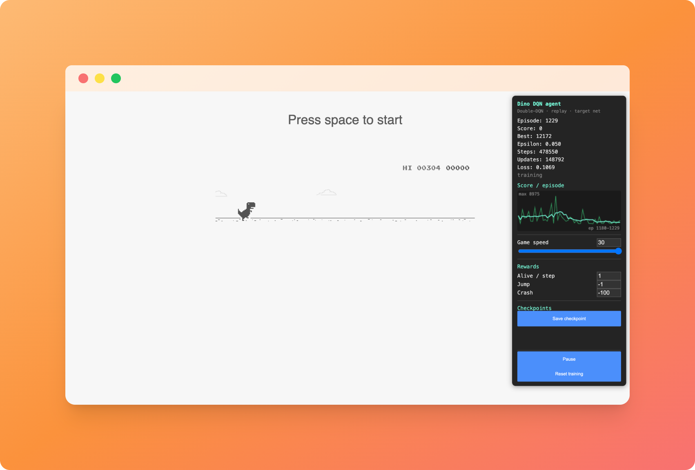

# dino-rl

A reinforcement-learning agent that learns to play the Chrome offline Dino game,
running entirely in the browser.

## What it is

The game (`dino.html`) is the original Chrome T-Rex runner. The agent
(`dqn-agent.js`) hooks directly into the game's internal state via
`Runner.instance_` — it reads the game variables, not pixels — and learns to
play by controlling the dino.

## Algorithm

A from-scratch **Double-DQN** (no ML libraries):

- Q-network: a small MLP (8 -> 32 -> 32 -> 2), ReLU hidden layers, Adam optimiser
- Continuous, normalised 8-feature state (gaps, obstacle size, speed, jump state)
- Experience replay buffer
- Separate target network, periodically synced
- Double-DQN targets and Huber / gradient-clipped TD error
- Epsilon-greedy exploration with step-based decay

`rl-agent.js` is a legacy tabular Q-learning agent, kept for reference.

## Features

- Variable game speed (0.5x to 30x) for fast training
- Named checkpoints saved to localStorage: save, load, delete
- Editable reward terms (alive / jump / crash) at runtime
- Live score-per-episode graph (sliding window of the last 50 episodes)

## Usage

Open `dino.html` in Chrome. The agent starts automatically and a control panel
appears in the top-right corner. Training progress is persisted to localStorage,
so it resumes across page reloads.
